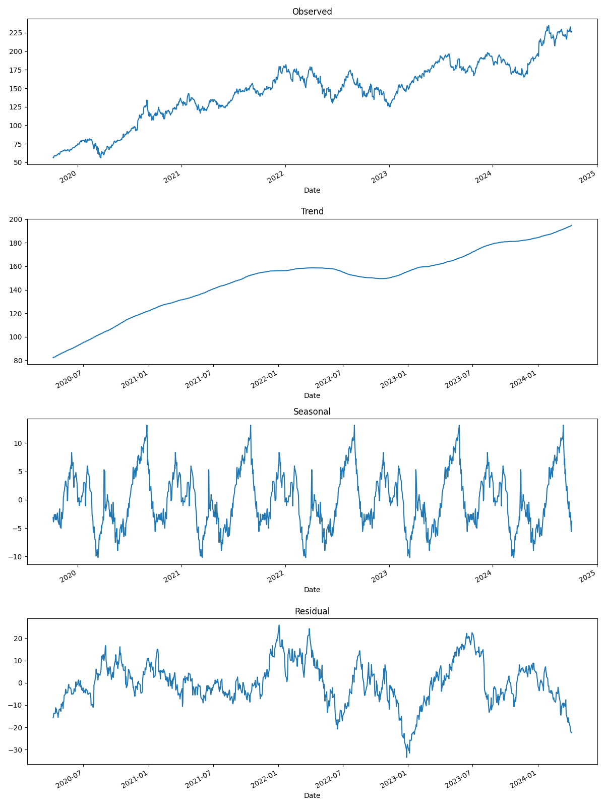
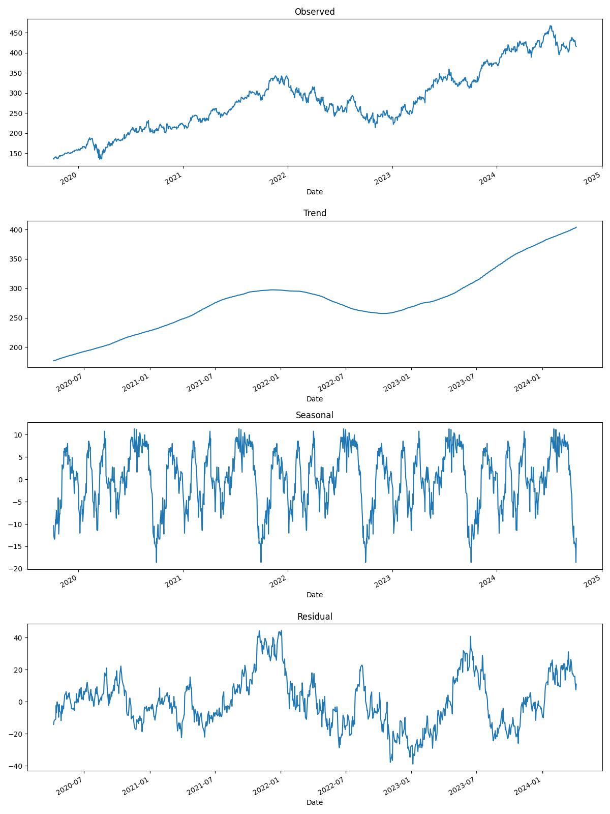
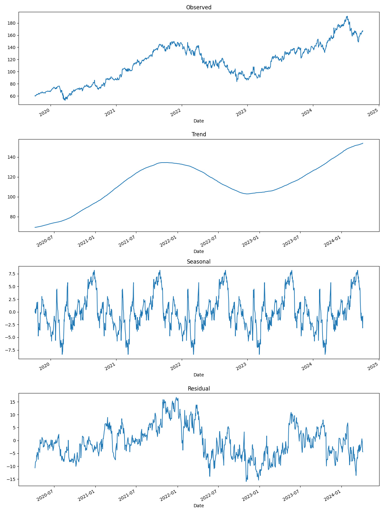
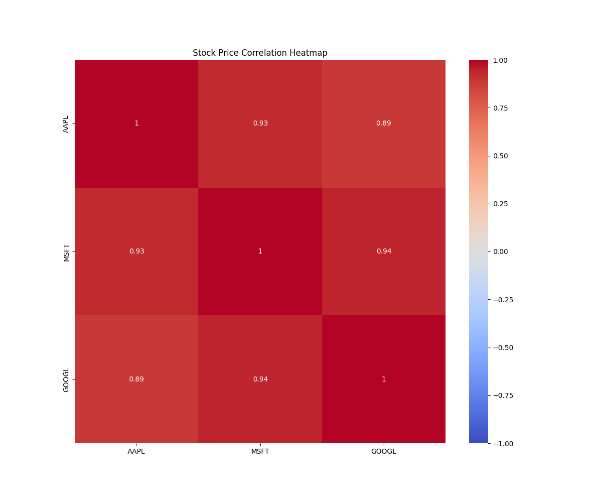

# 🚀 StockSense: Real-Time Market Analysis & Prediction Platform

## 🌟 Project Overview
StockSense is a project that leverages real-time data and ML to provide unparalleled insights into stock market trends and predictions. By combining advanced web scraping techniques, robust ETL processes, cloud-based data warehousing, state-of-the-art machine learning models, and interactive data visualizations, StockSense empowers investors to make informed decisions with confidence.

## 🔑 Key Features
- **Real-time Data Scraping**: Stay ahead of the market with up-to-the-minute stock information
- **Robust ETL Pipeline**: Efficiently process and load data into a scalable cloud data warehouse
- **Intelligent Storage**: Leverage the power of Snowflake or Redshift for efficient data management
- **Predictive Analytics**: Utilize LSTM neural networks to forecast market trends
- **Interactive Visualizations**: Gain deep insights through stunning, interactive data representations

## 🛠 Technology Stack
StockSense harnesses a powerful combination of technologies:

- **Python Ecosystem**:
  - 🐼 Pandas: Data manipulation and analysis
  - 🧠 TensorFlow & scikit-learn: Powering our predictive AI models
  - 🔗 SQLAlchemy: Seamless database interactions
- **Data Warehousing**:
  - ❄ Snowflake or 🚀 Redshift: Scalable, cloud-native storage solutions
- **Visualization**:
  - 📊 Plotly: Create interactive HTML-based charts
  - 📈 Matplotlib: Generate static visualizations

## 📂 Project Structure

```bash
stock_market_analysis/
├── data/
│   ├── AAPL_stock_data.csv
│   ├── MSFT_stock_data.csv
│   ├── GOOGL_stock_data.csv
│   └── stock_data.db
├── src/
│   ├── scraper.py           # Fetches stock data from Yahoo Finance API
│   ├── etl_pipeline.py      # Performs Extract, Transform, and Load operations
│   ├── model.py             # LSTM-based model for stock price prediction
│   └── visualization.py     # Visualization of stock data and technical indicators
├── output/
│   ├── AAPL_candlestick.html
│   ├── MSFT_candlestick.html
│   ├── GOOGL_candlestick.html
│   ├── AAPL_advanced_technical.html
│   ├── MSFT_advanced_technical.html
│   ├── GOOGL_advanced_technical.html
│   ├── AAPL_seasonal_decomposition.png
│   ├── MSFT_seasonal_decomposition.png
│   ├── GOOGL_seasonal_decomposition.png
│   └── correlation_heatmap.png
├── README.md
├── requirements.txt         # Python dependencies
└── .gitignore

 ```

## 🚀 Setup Instructions

1. Clone the repository:
   ```
   git clone https://github.com/Vignesh-Hariharan/stock-market-analysis.git
   cd stock-market-analysis
   ```

2. Create a virtual environment and activate it:
   ```
   python -m venv venv
   source venv/bin/activate  # On Windows, use `venv\Scripts\activate`
   ```

3. Install the required packages:
   ```
   pip install -r requirements.txt
   ```

4. Run the scraper to fetch stock data:
   ```
    python src/scraper.py --tickers AAPL MSFT GOOGL --start_date YYYY-MM-DD --end_date YYYY-MM-DD --output_dir data/

   ```

5. Run the ETL pipeline:
   ```
    python src/etl_pipeline.py

   ```

6. Train the machine learning model:
   ```
    python src/model.py --db_path data/stock_data.db --ticker AAPL --epochs 50 --batch_size 32
   ```

7. Generate visualizations:
   ```
    python src/visualization.py --tickers AAPL MSFT GOOGL --input_dir data/ --output_dir output/
   ```

## 📊 Data Flow

1. **Data Fetching**: Real-time stock data is fetched from the Yahoo Finance API using yfinance.
2. **Data Storage**: Scraped stock data is saved as CSV files in the data/ directory and loaded into an SQLite database (stock_data.db).
3. **ETL Process**:The data is extracted from CSV files, transformed (cleaned, aggregated, technical indicators added), and loaded into the SQLite database.
4. **Machine Learning**: Historical data is used to train an LSTM model for price predictions.
5. **Visualization**: Various visualizations are generated and saved in the `output/` directory.

## 📈 Outputs and Visualizations

StockSense generates a variety of outputs to provide comprehensive insights:

### 1. Candlestick Charts
Interactive HTML charts for AAPL, MSFT, and GOOGL stocks.

- [AAPL Candlestick Chart](output/AAPL_candlestick.html)
- [MSFT Candlestick Chart](output/MSFT_candlestick.html)
- [GOOGL Candlestick Chart](output/GOOGL_candlestick.html)

### 2. Advanced Technical Indicator Plots
HTML-based interactive charts with various technical indicators.

- [AAPL Advanced Technical Indicators](output/AAPL_advanced_technical.html)
- [MSFT Advanced Technical Indicators](output/MSFT_advanced_technical.html)
- [GOOGL Advanced Technical Indicators](output/GOOGL_advanced_technical.html)

### 3. Seasonal Decomposition
PNG images showing trend, seasonal, and residual components of each stock's time series.





### 4. Correlation Heatmap
A PNG image visualizing the correlation between different stocks.



All these outputs can be found in the `output/` directory of the project.

## 📜 License

This project is licensed under the MIT License - see the [LICENSE](LICENSE) file for details.

<p align="center">Made by Vignesh</p>
